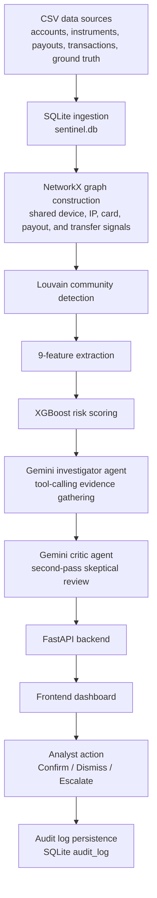

# Abuse Ring Sentinel Architecture

Abuse Ring Sentinel turns related account and transaction signals into candidate abuse-ring clusters, scores those clusters, and gives an analyst a browser-based investigation workflow.

## Pipeline

## Data and graph layer

`data/` contains the CSV inputs used by `pipeline/run_pipeline.py`. The runner initializes the SQLAlchemy schema, loads accounts, instruments, payout destinations, transactions, and ground-truth records into SQLite, then builds a graph with `pipeline/build_graph.py`.

The graph connects accounts through shared signals including devices, IP addresses, card fingerprints, payout destinations, and peer-to-peer transfers. `pipeline/detect_clusters.py` applies NetworkX Louvain community detection to identify candidate communities.

## Features and scoring

`pipeline/cluster_features.py` extracts the nine cluster features used by the model: cluster size, graph density, shared-device ratio, shared-IP ratio, shared-payout ratio, average risk score, transaction velocity, decline rate, and rapid-drain ratio.

`pipeline/train_model.py` trains the default XGBoost classifier and scores detected clusters. The score is used to classify a cluster as an abuse ring or legitimate look-alike and to refine its ring type and investigation status.

## Investigation layer

`agent/agent.py` orchestrates the investigation flow. `agent/investigator.py` uses Gemini tool-calling to gather cluster features, shared signals, account details, and historical cases. `agent/critic.py` performs a second skeptical review and returns adjusted confidence, counter-considerations, and a final recommendation.

When Gemini quota is unavailable, `backend/routes/agent_route.py` returns stored investigation data or a structured fallback payload so the dashboard remains usable.

## API and analyst workflow

`backend/main.py` serves the FastAPI application and static frontend. The cluster routes expose list/detail APIs, status updates, and audit-history retrieval. A status update writes an `AuditLog` record containing the action, previous status, optional note, and timestamp.

`frontend/` renders the dashboard, cluster metrics, entity graph canvas, investigation evidence, critique, member data, transactions, and action history. Analysts can Confirm, Dismiss, or Escalate a cluster from the investigation modal.

## Why this shape

The architecture separates deterministic data processing from optional AI interpretation. Graph construction and feature scoring provide repeatable evidence, while the investigator and critic agents turn that evidence into readable analyst guidance. The API and frontend remain useful when live model calls are unavailable, and audit persistence keeps human decisions traceable.
